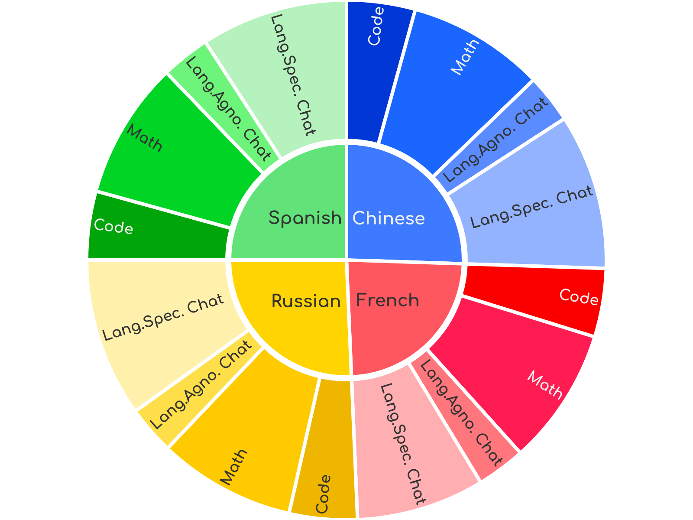
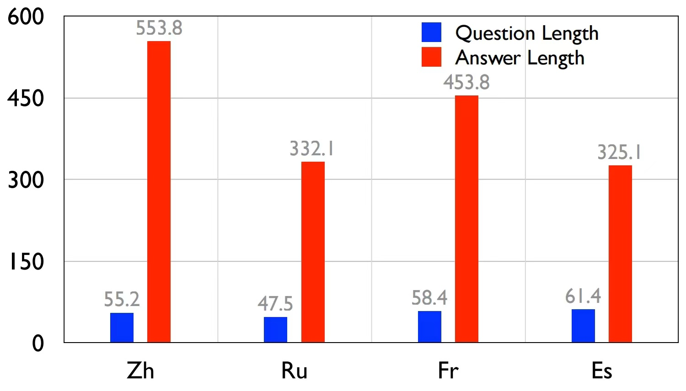
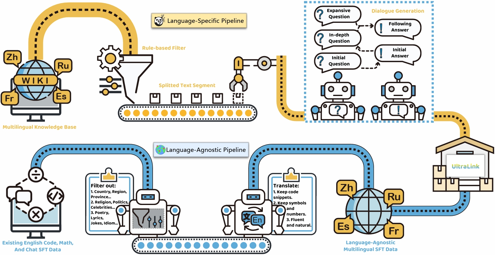

<div align="center">


**multi-lingual, knowledge-grounded, multi-round dialogue dataset and model**

<p align="center">
 <a href="#Introduction"> Introduction </a> •
 <a href="#Construction-of-UltraLink">Construction Process</a> •
 <a href="https://arxiv.org/abs/2402.04588">Paper</a> •
 <a href="https://huggingface.co/datasets/R0k1e/UltraLink"> UltraLink</a> •
 <a href="https://huggingface.co/R0k1e/UltraLink-LM"> UltraLink-LM</a>
</p>
</div>

## News
- ❗️❗️ Febrary 6, 2024: Releasing a multi-lingual, knowledge-grounded data augmented, multi-round dialogue dataset UltraLink and the model weight of UltraLink-LM.

## Introduction
### UltraLink
UltraLink is a multi-lingual, knowledge-grounded data augmented, multi-round dialogue dataset. It contains language-specific chat data, language-agnostic chat data, code data and math data in 5 languages: English, Chinese, Spanish, Russian, and French. It can be downloaded in this huggingface [link](https://huggingface.co/datasets/R0k1e/UltraLink).
Different from previous works that simply translate English instructions, **we consider both the language-specific and language-agnostic abilities of LLMs.** Firstly, we introduce a knowledge-grounded data augmentation approach to elicit more culture-specific knowledge of LLMs, improving their ability to serve users from different countries. Moreover, we find modern LLMs possess strong cross-lingual transfer capabilities, thus repeatedly learning identical content in various languages is not necessary. Consequently, **we can substantially prune the language-agnostic SFT data without any performance degradation**, making multilingual SFT more efficient. 

### UltraLink-LM
> The UltraLink-LM is a massively multilingual generative language model that follows instructions in 5 languages, English, French, Russian, Spanish, and Chinese. The model is capable of generating text in 5 languages with high quality and diversity.
> UltraLink-LM outperforms [PolyLM-Chat-13b](https://huggingface.co/DAMO-NLP-MT/polylm-chat-13b), [Guanaco](JosephusCheung/Guanaco),  and [Bloomz-7b1-mt](https://huggingface.co/bigscience/bloomz-7b1-mt) in code, math and chat abilities in four languages, and has a high-quality and diverse text generation performance in all languages.
> The UltraLink-LM is trained using [UltraLink](https://huggingface.co/datasets/R0k1e/UltraLink), [UltraChat](https://huggingface.co/datasets/stingning/ultrachat), [Magicoder-Evol](https://huggingface.co/datasets/ise-uiuc/Magicoder-Evol-Instruct-110K), [Magicoder-OSS](https://huggingface.co/datasets/ise-uiuc/Magicoder-OSS-Instruct-75K), [MetaMathQA](https://huggingface.co/datasets/meta-math/MetaMathQA), and [ShareGPT](https://huggingface.co/datasets/openchat/openchat_sharegpt4_dataset/).
> We release the checkpoints under a MIT license to further our mission of multilingual technologies empowering a multilingual world. It can be downloaded in this huggingface [link](https://huggingface.co/R0k1e/UltraLink-LM).

- **Developed by:** [OpenBMB]((https://www.openbmb.cn/home))
- **Model type:** a Transformer style autoregressive massively multilingual language model.
- **Paper**: [UltraLink: An Open-Source Knowledge-Enhanced Multilingual Supervised Fine-tuning Dataset](https://arxiv.org/abs/2402.04588)
- **Languages**: Refer to the list of languages in the `language` section of this model card.
- **License**: MIT
- **Model**: [UltraLink-LM](https://huggingface.co/R0k1e/UltraLink-LM)
- **Model Size**: 13 billion parameters
- **Datasets**: [UltraLink](https://huggingface.co/datasets/R0k1e/UltraLink), [UltraChat](https://huggingface.co/datasets/stingning/ultrachat)(random select 10k samples), [Magicoder-Evol](https://huggingface.co/datasets/ise-uiuc/Magicoder-Evol-Instruct-110K), [Magicoder-OSS](https://huggingface.co/datasets/ise-uiuc/Magicoder-OSS-Instruct-75K), [MetaMathQA](https://huggingface.co/datasets/meta-math/MetaMathQA), and [ShareGPT](https://huggingface.co/datasets/openchat/openchat_sharegpt4_dataset/)(the English part of the dataset whose sample length is greater than 4k).

<details><summary> <b> Performance </b> </summary>
<p>

We report three evaluations in this section: multilingual HumanEval, MGSM, and OMGEval.
Evaluations of modern LLMs may be biased and affected by many factors, we are also actively working on more comprehensive evaluation methods.

### Multilingual HumanEval 

[HumanEval](https://github.com/openai/human-eval) is a well-known benchmark for evaluating the code ability of LLMs. It execute the code snippets generated by the model and evaluate their correctness.  Since there are no existing multilingual test set for code generation, we use GPT-3.5 with carefully-designed prompts to translation HumanEval into other languages.

|Model|En|Zh|Es|Ru|Fr|Avg|
|-----|---|---|---|---|---|---|
|Aya | 6.1 | 9.75 | 6.1 | 8.53 | 4.27 | 6.95 |
|Bloomz-7b1-mt | 8.5 | 7.3 | 6.1 | 8.5 | 6.1 | 7.3 |
|Phoenix-inst-chat-7b | 11.0 | 10.4 | 8.5 | 1.2 | 13.4 | 12.2 |
|PolyLM-Multialpaca-13b | 8.5 | 7.3 | 6.1 | 6.1 | 6.1 | 6.8 |
|PolyLM-Chat-13b | 10.4 | 7.9 | 6.1 | 7.3 | 8.5 | 8.1 |
|Chimera-inst-chat-13b| 14.6 | 13.4 | 14.6 | 12.8 | 14.0 | 13.9 |
|Okapi-7b | 12.2 | 11.0 | 8.5 | 8.5 | 8.5 | 9.8 |
|Guanaco-7b | 9.2 | 6.7 | 11.0 | 9.8 | 12.8 | 9.9 |
|Guanaco-13b| 18.3 | 15.9 | 9.8 | 8.5 | 14.6 | 12.2 |
|**UltraLink-LM**  | __60.4__ | __43.9__ | __40.9__ | __49.4__ | __39.6__ | __46.8__|


### MGSM

We employ [MGSM](https://github.com/google-research/url-nlp/tree/main/mgsm) to evaluate the math reasoning abilities, which is a multilingual benchmark. It compares the result with correct answers and evaluates the model's ability to perform mathematical reasoning.
|Model|En|Zh|Es|Ru|Fr|Avg|
|-----|---|---|---|---|---|---|
|Aya-101| 8.8 | 4 | 6 | 8 | 9.2 | 7.2 |
|Aya| 28.8 | 5.6 | 18 | 17.2 | 19.2 | 17.76 |
|Bloomz-7b1-mt | 2.8 | 1.6 | 2.0 | 0.4 | 2.8 | 1.7 |
|Phoenix-inst-chat-7b | 3.2 | 3.2 | 2.8 | 3.2 | 3.2 | 3.1 |
|PolyLM-Multialpaca-13b | 1.2 | 2.8 | 1.6 | 2.8 | 2.4 | 2.4 |
|PolyLM-Chat-13b | 10.8 | 6.4 | 4.8 | 4.4 | 5.6 | 5.3 |
|Chimera-inst-chat-13b  | 14.0 | 11.6 | 10.0 | 12.0 | 12.8 | 11.6 |
|Okapi-7b | 4.0 | 2.4 | 3.6 | 4.4 | 4.8 | 3.8 |
|Guanaco-7b | 4.0 | 1.6 | 3.2 | 2.8 | 4.4 | 3.0 |
|Guanaco-13b | 13.6 | 10.8 | 11.2 | 6.4 | 5.2 | 8.4 |
|**UltraLink-LM**| __70.4__ | __56.0__ | __70.4__ | __64.8__ | __63.6__ | __65.04__ |

### OMGEval
We use the [OMGEval](https://github.com/blcuicall/OMGEval) to evaluate the chat ability, which is a multilingual version of the widely-used English benchmark AlpacaEval.

|Model|En|Zh|Es|Ru|Fr|Avg|
|-----|---|---|---|---|---|---|
|Aya-101 | 1.37 | 3.9 | 4.1 | 7.73 | 2.03 | 3.83 |
|Aya | 27.61 | 16.88 | 20.51 | 34.25 | 16.75 | 23.2 |
|Bloomz-7b1-mt | 0.0 | 0.9 | 0.1 | 0.5 | 0.3 | 0.4 |
|Phoenix-inst-chat-7b  | 6.9 | 13.3 | 7.4 | 2.9 | 8.1 | 7.7 |
|PolyLM-Multialpaca-13b  | 3.4 | 5.0 | 2.1 | 5.1 | 2.2 | 3.6 |
|PolyLM-Chat-13b | 7.7 | 14.0 | 6.1 | 5.5 | 4.8 | 7.6 |
|Chimera-inst-chat-13b | 15.5 | 9.7 | 11.8 | 13.7 | 13.8 | 12.9 |
|Okapi-7b | 8.8 | 6.2 | 5.0 | 12.1 | 8.7 | 8.2 |
|Guanaco-7b  | 4.6 | 3.8 | 0.4 | 1.8 | 1.2 | 2.4 |
|Guanaco-13b  |  __29.0__ | 8.6 | 16.9 | 15.4 | 17.3 | 17.5 |
|**UltraLink-LM** |  28.8 |  __21.9__ |  __23.5__ | __37.6__ | __29.0__ |  __28.2__  |

### ARC

| Model                  | En    | Zh    | Es    | Ru        | Fr    | Avg   |
| ---------------------- | ----- | ----- | ----- | --------- | ----- | ----- |
| Aya-101                | 73.08 | 51.88 | 43.33 | 45.42     | 55.77 | 53.90 |
| Aya                    | 63.95 | 47.35 | 22.05 | 33.28     | 45.25 | 42.38 |
| Bloomz-7b1-mt          | 77.51 | 57.79 | 60.60 | 35.59     | 60.74 | 58.45 |
| Phoenix-inst-chat-7b   | 69.98 | 47.17 | 41.20 | 30.20     | 51.41 | 47.99 |
| PolyLM-Multialpaca-13b | 31.06 | 25.51 | 21.54 | 27.97     | 29.00 | 27.01 |
| PolyLM-Chat-13b        | 29.31 | 12.33 | 26.50 | 24.38     | 26.95 | 23.89 |
| Chimera-inst-chat-13b  | 66.23 | 31.16 | 45.30 | 42.26     | 32.16 | 43.42 |
| Okapi-7b               | 59.75 | 39.90 | 38.03 | 38.84     | 42.86 | 43.88 |
| Guanaco-7b             | 36.08 | 25.60 | 27.26 | 25.83     | 27.63 | 28.48 |
| Guanaco-13b            | 60.79 | 39.38 | 6.50  | 13.77     | 17.71 | 27.63 |
| **UltraLink-LM**       | 76.04 | 50    | 47.35 | **51.32** | 58.85 | 56.71 |

### Hellaswag

| Model                  | En        | Zh        | Es        | Ru        | Fr        | Avg      |
| ---------------------- | --------- | --------- | --------- | --------- | --------- | -------- |
| Aya-101                | 75.53     | 50.47     | 62.72     | 54.68     | 61.33     | 60.95    |
| Aya-101 新测           | 42.97     | 38.14     | 40.81     | 38.74     | 40.98     | 40.33    |
| aya-101 新框架         | 43.87     | /         | 41.7      | 39.45     | 41.49     | 41.63    |
| Aya                    | 76.70     | 48.87     | 62.58     | 53.78     | 61.14     | 60.61    |
| Bloomz-7b1-mt          | 61.07     | 47.53     | 48.55     | 33.06     | 46.16     | 47.27    |
| Phoenix-inst-chat-7b   | 56.75     | 49.07     | 54.28     | 32.50     | 53.21     | 49.16    |
| PolyLM-Multialpaca-13b | 65.96     | 49.76     | 51.29     | 46.38     | 50.69     | 52.82    |
| PolyLM-Chat-13b        | 66.58     | 48.91     | 52.05     | 45.61     | 51.34     | 52.90    |
| Chimera-inst-chat-13b  | 65.84     | 43.17     | 52.58     | 45.87     | 50.74     | 51.64    |
| Okapi-7b               | 63.67     | 44.60     | 50.96     | 45.87     | 49.64     | 50.95    |
| Guanaco-7b             | 65.25     | 37.12     | 43.65     | 35.00     | 42.35     | 44.67    |
| Guanaco-13b            | 74.51     | 43.37     | 60.57     | 51.81     | 58.39     | 57.73    |
| **UltraLink-LM**       | **77.46** | **52.77** | **64.77** | **56.05** | **63.45** | **62.9** |

### MMLU

| Model                  | En        | Zh        | Es        | Ru        | Fr        | Avg       |
| ---------------------- | --------- | --------- | --------- | --------- | --------- | --------- |
| Aya-101                | 39.94     | 40.69     | 41.38     | 39.99     | 41.19     | 40.64     |
| Aya-old                | 51.52     | 38.68     | 44.85     | 40.82     | 45.23     | 44.22     |
| Bloomz-7b1-mt          | 35.89     | 33.56     | 34.67     | 25.88     | 35.1      | 33.02     |
| Phoenix-inst-chat-7b   | 38.53     | 35.58     | 36.49     | 25.8      | 36.88     | 34.66     |
| PolyLM-Multialpaca-13b | 26.7      | 25.63     | 24.98     | 24.72     | 25.51     | 25.51     |
| PolyLM-Chat-13b        | 29.25     | 28.32     | 25.83     | 26.2      | 27.31     | 27.38     |
| Chimera-inst-chat-13b  | 48.07     | 31.9      | 40.75     | 37.22     | 41.83     | 39.95     |
| Okapi-7b               | 41.39     | 34.94     | 37.65     | 34.23     | 37.53     | 37.15     |
| Guanaco-7b             | 28.91     | 24.99     | 27.05     | 26.21     | 27.42     | 26.92     |
| Guanaco-13b            | 50.62     | 36.6      | 44.35     | 38.26     | 43.75     | 42.72     |
| **UltraLink-LM**       | **54.22** | **42.71** | **48.95** | **44.39** | **48.29** | **47.71** |

</p>
</details>

## Data


### Data Release
The data consists of four parts, code data, math data, language-specific chat data, and language-agnostic chat data. Each type of data has been marked using the title of each file. For example, the en_code.jsonl specifies the English code data.

- 🤗 [Huggingface Datasets Host](https://huggingface.co/datasets/R0k1e/UltraLink)

### Categories

There are 4 types of data in UltraLink, which are code data, math data, language-agnostic chat data, and language-specific chat data. All types of data are expressed in previously mentioned 5 languages. Each type of data has been marked using the title of each file. **They are all named as the format ``` {linguistic type}_{data type}.jsonl```**. For example, the ```en_code.jsonl``` specifies the English code data.

* **Code data**(```code```): Code generation, which is generated with our language-agnostic pipeline. 
* **Math data**(```math```): Math reasoning, which is generated with our language-agnostic pipeline.
* **Language-agnostic chat data**(```chat_agnostic```): The dialogue that is not related to the language itself and the related culture. The data is generated with our language-agnostic pipeline.
* **Language-specific chat data**(```chat_specific```): The dialogue that is highly related to the language itself and the related culture. The data is generated with our language-specific pipeline.

<div align="center">

</div>


### Statistics

UltraLink contains Language-specific Chat data (147K), Language-agnostic Chat data (112K), Math data (523K), and Code data (250K), which are measured by the number of dialogues.

The estimated average lengths of questions and answers are shown in the figure below, which are measured by the number of tokens. The answer is significantly longer than the question across all languages.

<div align="center">

</div>


### Comparison

UltraLink contains **multi-turn conversations** and exhibits the **longest average length per turn** (i.e., 378.21 tokens), considering both questions and answers. The table below shows the comparison between UltraLink and existing open-source multilingual SFT datasets.

| Dataset                                                      | Dialogues   | Turns       | Question(Avg) | Answer(Avg)  | Turn(Avg)    |
| ------------------------------------------------------------ | ----------- | ----------- | ------------- | ------------ | ------------ |
| Okapi Dataset ([Lai et al., 2023](https://aclanthology.org/2023.emnlp-demo.28)) | 207K        | 207K        | 28.64         | 95.72        | 124.36       |
| Guanaco Dataset ([Attardi, 2023](https://guanaco-model.github.io/)) | ***1173K*** | 1173K       | 77.58         | 83.31        | 160.89       |
| Multialpaca ([Wei et al., 2023a](https://api.semanticscholar.org/CorpusID:259837230)) | 132K        | 132K        | 39.86         | 83.71        | 123.57       |
| Phoenix SFT data ([Chen et al., 2023](https://api.semanticscholar.org/CorpusID:258236343)) | 464K        | 893K        | ***165.27***  | 200.07       | 365.34       |
| UltraLink (***Ours***)                                       | 1032K       | ***1623K*** | 87.86         | ***290.35*** | ***378.21*** |


### Data Format
Each line in the downloaded data file is a json dict containing the data id and dialogue data in a list format. The id is begin with the file name and connected with the sequence number. Below are example lines.

```
{
      "id": "zh_chat_specific_191", 
      "data": [
            "请根据以下给定的文档回答我的问题。<document>李娅\n\n李娅，安徽蚌埠人，中国退役女子体操运动员，强项为高低杠和平衡木。在中国体操队昵称“小胖”。\n生平.\n运动生涯.\n李娅1993年开始练习体操，1999年进入安徽队，2002年入选国家队，教练为刘桂成和何花。2002年李娅在全国体操冠军赛获得平衡木冠军，开始斩露头角。2003年李娅出征第37届美国安那罕世界体操锦标赛，获得团体第四和平衡木单项第四。\n2004年对于李娅来说是不寻常的一年。在获得全国平衡木冠军和全能亚军后，她参加了雅典奥运会，发挥失常。随后在世界杯英国格拉斯哥和比利时根特系列赛上，她都获得了平衡木冠军。2004年12月，李娅在英国伯明翰市举行的第12届世界杯总决赛上，李娅是发挥最好的中国女选手，获得了平衡木的银牌和高低杠的铜牌。\n2005年李娅由于受伤，没有参加世界体操锦标赛，她在澳门举行的第四届东亚运动会上获得了高低杠金牌。\n2006年3月李娅参加了在比利时根特举行的世界杯系列站获得高低杠金牌。两周以后在德国科特布斯举行的世界杯系列站她也获得了高低杠金牌。这两次亮相她以一套全新的，难度很大的高低杠动作技压全场，成功作出“前空翻转体180度抓杠直接接前空翻”。同年七月，她在中国上海举行的世界杯系列站获得平衡木银牌。\n李娅参加了2006年10月在丹麦奥胡斯第39届体操世锦赛。她在预赛中发挥失常，平衡木上做她准备申报命名的“屈体前空翻转体180度站木”时掉下器械，不但没能获得动作的命名，也没能进入该项目的决赛。而她擅长而原本有希望冲击奖牌的高低杠的比赛也是失误连连。由于失误，她原本申报打算获得命名的动作“前空翻转体180抓杠”也未能成功使用。即使这样，她在高低杠项目上申报的另外一个动作“后摆阿拉伯前屈两周下”还是得到了国际体操联合会的认可，并且获得了正式命名。李娅在决赛前的热身活动中突然临阵主动提出退赛，最终教练组在决赛中没有安排李娅上场。最终中国女队第一次获得世界体操锦标团体冠军，李娅作为团体成员也获得一枚金牌。受此影响，她也没有参加同年在卡塔尔首都多哈举行的2006年亚洲运动会。\n但是，李娅很快从失败中走出来。同年12月，在巴西圣保罗举行的第13届世界杯总决赛上，她又成功做出了她的高难动作，最后获得高低杠银牌，英国运动员获得了这个项目的金牌。李娅还获得了平衡木的金牌。赛后，国际体操联合会将“前空翻转体180度抓杠”这个高难度动作命名为“李娅空翻”。\n2007年初，李娅的状况仍不错，更于世界杯马里博尔站夺得高低杠金牌，所以亦被认定为北京奥运会的夺金希望。好景不常，2007年7月中旬的一次训练中，李娅在做前空翻180度接抓杠再接前空翻时，因为没能抓住杠，摔落时手撑地，导致肘关节脱节。经过检查，发现李娅桡骨小头骨骺及桡骨环状韧带损伤，因此李娅亦缺席九月初举行的世锦赛。\n自此之后，她的比赛及训练次数都减少，直至2008年宣布退役，结束她15年的体操生涯。\n退役生涯.\n2008年，李娅退役后入读北京体育大学，并有意向娱乐圈发展。\n2009年6月25日晚，李娅在某餐厅就餐时，服务员上菜时不小心把菜汤打翻，导致她双腿、右臂大面积严重烫伤，被鉴定为十级伤残。及后法院判决李娅获赔6万余元。\n2018年，李娅担任中华队女子体操队教练。\n2021年，李娅担任台北市松山区三民国民小学体操队教练。\n命名动作.\n一共有两个体操动作以李娅的名字命名：</document>李娅在奥运会失常后，为什么能够快速从失败中恢复并取得更好的成绩？", 
            "李娅在奥运会失常后能够快速从失败中恢复并取得更好的成绩，可能有以下几个原因：\n\n首先，李娅具备坚韧的心理素质。作为一位体操运动员，她经历了无数次的挫折和困难，已经养成了不轻易放弃的品质。她知道失败是成功的一部分，并且能够从失败中吸取经验教训，保持积极的心态并继续努力。\n\n其次，李娅拥有良好的训练和教练团队的支持。在奥运会失常后，李娅可能经过了深入的反思和训练调整。她的教练和团队可能对她进行了专门的指导和训练，帮助她纠正问题，并提供正确的心理支持和鼓励。\n\n此外，李娅可能在比赛中表现出更高的动力和动作难度。奥运会失常后，她可能意识到自己在技术和难度方面还有提升的空间。通过更加刻苦的训练和尝试更多的高难度动作，她能够在比赛中展现更好的表现，提高自己的成绩。\n\n综上所述，李娅之所以能够快速从奥运会失常中恢复并取得更好的成绩，可能是由于她良好的心理素质、训练团队的支持以及更高的动力和动作难度。这些因素共同作用，使她能够逐步克服挫折，获得更好的成绩。",
            "李娅如何在退役后选择继续教练的职业，并且在教练生涯中表现出色？", 
            "李娅在退役后选择继续教练的职业可能是基于她对体操运动的热爱和对年轻运动员的培养的兴趣。作为一位退役的体操运动员，她拥有丰富的经验和专业知识，可以将这些宝贵的资源传授给新一代的体操运动员，并帮助他们实现自己的梦想。\n\n在教练生涯中，李娅可能表现出色的原因有以下几点：\n\n首先，她拥有出色的技术和训练经验。作为一位顶级的体操运动员，李娅在自己的运动生涯中积累了丰富的技术和训练知识。她熟悉各种动作的要领和细节，能够教授给学生正确的技术和训练方法。\n\n其次，李娅可能具备良好的沟通能力和教学技巧。作为一名优秀的教练，不仅需要拥有优秀的技术水平，还需要能够与学生建立起良好的沟通和理解，了解他们的需求和困惑，并能够给予及时和有效的指导和帮助。李娅可能通过自己的亲身经历，能够更好地理解学生的心理和需求，并给予正确的指导和鼓励。\n\n此外，李娅可能在教练生涯中注重培养学生的全面素质。体操运动不仅仅是技术的表演，还需要对身体素质、灵敏度、协调性等多个方面进行训练。李娅可能注重培养学生的综合素质，帮助他们在体操运动中得到全面的发展。\n\n最后，李娅可能对学生有着耐心和关爱。作为一名优秀的教练，需要对学生保持耐心和温柔，关注学生的身心健康，并给予他们充分的支持和鼓励。李娅可能能够运用自己的亲身经历和理解，给予学生更多的关爱和帮助。\n\n综上所述，李娅在退役后选择继续教练的职业，并且在教练生涯中表现出色可能是由于她拥有出色的技术和训练经验、良好的沟通能力和教学技巧、注重培养学生的全面素质，以及耐心和关爱学生。这些因素共同作用，使她能够在教练岗位上取得出色的表现。"
      ]
}
{
      "id": "fr_chat_specific_1", 
      "data": [
            "Veuillez répondre à ma question en vous basant sur le document suivant. <document> Borne routière\n\nUne borne routière est un élément signalétique placé régulièrement en bordure de route et destiné à identifier la route concernée et à y indiquer les distances, le plus souvent vers les localités voisines. \nEn France, les bornes routières équipent les anciens réseaux nationaux, les réseaux départementaux et autoroutiers. Elles sont entrées dans le langage familier comme synonyme de kilomètre parcouru, parfois à tort, car elles ne tiennent pas toujours compte des derniers aménagements et tracés routiers et n'indiquent pas nécessairement des distances kilométriques exactes. Au fil des années, elles deviennent des points de localisation plus que des points kilométriques exacts.\nAu Royaume-Uni, certaines bornes routières sont classées monument historique.\nHistorique du bornage.\nEn France.\nBornes royales.\nSous Louis XV, à partir de 1745, des bornes en pierre de de haut sont mises en place sur les routes royales. Elles sont ornées d'une fleur de lys en bas-relief dans un cartouche ovale, au-dessus duquel figure un nombre se référant à une distance. C'est la distance en milliers de toises depuis le point zéro situé sur le parvis de Notre-Dame de Paris. Ces bornes sont implantées toutes les mille toises, soit à intervalle d'une demi-lieue (lieue de Paris) ou environ . C'est pourquoi, elles sont appelées à l'époque et encore aujourd'hui, \"bornes milliaires\". La plupart des bornes sont des monolithes, réalisés avec la pierre locale, calcaire, grès ou granit. Généralement, elles sont de forme cylindrique ou bien tronconique, et reposent sur une base carrée pour l'ancrage au sol. Le chant supérieur de la base est parfois relevé d'une moulure simple ou en astragale. Les bornes sont toujours disposées sur le côté gauche de la route, lorsque l'on tourne le dos à Paris, afin de tenir compte de la position du postillon, qui chevauchait le cheval situé à gauche de l'attelage.\nLes fleurs de lys ont fréquemment été martelées à la Révolution, quelquefois remplacées par des symboles républicains comme le bonnet phrygien.\nSur la route vers Esternay (Marne) par exemple, 22 bornes existent encore aujourd'hui.\nAprès la Révolution.\nDès la Révolution, les grandes routes construites au ont été marquées sur la base du kilomètre sur le modèle des bornes milliaires romaines. Elles s'élevaient à un mètre environ du sol et leur sommet était peint en rouge afin d'être visible. \nCe bornage de kilomètre en kilomètre a été complété par des bornes hectométriques, dans les intervalles entre deux bornes kilométriques. Ces bornes intermédiaires étaient généralement constituées d'une pierre rectangulaire simplement numérotée, scellée sur le bord de la route. Une borne numérotée \"5\" était donc située à de deux bornes kilométriques. Neuf bornes hectométriques numérotées de \"1\" à \"9\" se succédaient ainsi entre deux bornes kilométriques. De nos jours, ce système n'est en général plus maintenu, excepté sur certaines routes des Alpes-de-Haute-Provence et plus rarement encore sur certaines routes départementales peu fréquentées).\nDans les villes, les rues et les trottoirs trop étroits ne permettaient pas toujours de placer une borne. On se contentait alors de peindre la borne sur le mur, comme à Ligugé (ci-dessous), sur la route départementale 86. On trouve le même type de \"bornage\" peint sur certains passages étroits de montagne.\nBornages spéciaux.\nLes panneaux PK sur autoroute.\nGrâce à la relative simplicité du tracé des autoroutes, des repères généralement sous forme de panneaux représentant une borne ou un indice de couleur blanche sur fond rectangulaire rouge sont utilisés. Les exploitants les appellent PK (points kilométriques) et précisent que l'intervalle est d'un kilomètre environ.\nLes bornes de limite départementale.\nChaque passage de limite de département est marqué d'une borne plus importante en taille, indiquant le nom des deux départements et les distances à parcourir pour rejoindre les villes les plus proches. Certaines possèdent l'indication de distance des villes les plus proches ou encore, en zone de montagne, l'altitude.\nDifférents modèles se sont succédé en fonction des années, et aussi des départements, pour le réseau intra-départemental. Les bornes courantes ont gardé la forme d'une borne en pierre mais sont fabriquées en plastique rigide. Les versions récentes se présentent sous forme d'un panneau plat conservant la forme arrondie du sommet, avec un revêtement réfléchissant qui les rend plus lisibles à la lumière des phares de voitures. Il existe également des plaquettes vissées sur un support dédié ou sur un mur, notamment en agglomération où la place est comptée. \nLe réseau national étant aujourd'hui en grande partie intégré aux réseaux départementaux, quelques capuchons rouges peuvent encore subsister sur ces bornes de limites de départements, au bord de routes départementales ; leur temps est toutefois compté, tout comme celui des bornes kilométriques rouges sur les routes nationales déclassées.\nProduits dérivés.\nLes bornes routières ont inspiré divers produits et objets dérivés : le jeu de cartes des 1000 bornes (1954), les boîtes en carton en forme de bornes kilométriques N7 décorées en rouge et blanc dans lesquelles sont souvent livrés les nougats de Montélimar, ou les mini-bornes départementales commercialisées particulièrement appréciées par les randonneurs et cyclistes comme souvenirs des étapes de leurs circuits. </document> Comment les bornes routières en France ont-elles évolué au fil du temps et quelles sont les principales caractéristiques des différents types de bornes existants?", 
            "Les bornes routières en France ont connu plusieurs évolutions au fil du temps. Sous Louis XV, à partir de 1745, des bornes en pierre de 2,5 mètres de haut ont été placées sur les routes royales. Elles étaient ornées d'une fleur de lys et indiquaient la distance en milliers de toises depuis le point zéro situé sur le parvis de Notre-Dame de Paris. Ces bornes étaient implantées toutes les mille toises, soit à intervalle d'une demi-lieue, et étaient appelées \"bornes milliaires\". Ces bornes étaient principalement cylindriques ou tronconiques et reposaient sur une base carrée.\n\nAprès la Révolution, les grandes routes ont été marquées sur la base du kilomètre, avec des bornes d'environ un mètre de hauteur dont le sommet était peint en rouge. Ces bornes kilométriques étaient complétées par des bornes hectométriques, constituées d'une pierre rectangulaire simplement numérotée, situées à intervalles de 100 mètres environ.\n\nPlus récemment, les bornes routières en France ont connu une évolution vers des modèles fabriqués en plastique rigide, conservant la forme de bornes en pierre mais avec un revêtement réfléchissant pour une meilleure visibilité. Certains modèles sont également des plaquettes vissées sur un support dédié ou un mur. Les bornes de limite départementale sont de taille plus importante et indiquent le nom des deux départements et les distances vers les villes les plus proches.\n\nEn résumé, les principaux types de bornes routières en France sont les bornes milliaires en pierre avec fleur de lys, les bornes kilométriques et hectométriques en pierre ou peintes en rouge, et les bornes plus récentes en plastique rigide ou plaquettes vissées. Chaque type de borne a évolué en fonction des époques et des besoins de signalisation routière.", 
            "Comment les bornes routières en France ont-elles évolué au fil du temps et quelles influences ont-elles eu sur l'aménagement des routes et la navigation des conducteurs?", 
            "Les bornes routières en France ont connu plusieurs évolutions au fil du temps. Sous Louis XV, des bornes milliaires en pierre ont été mises en place sur les routes royales. Elles indiquaient la distance en milliers de toises depuis le point zéro à Notre-Dame de Paris. Ces bornes étaient placées régulièrement toutes les demi-lieues et étaient principalement utilisées pour le repérage des distances pour les conducteurs. Elles marquaient également l'aménagement des routes royales et servaient de référence pour le tracé des itinéraires.\n\nAprès la Révolution, les bornes kilométriques ont été introduites. Elles étaient peintes en rouge pour une meilleure visibilité et indiquaient les distances en kilomètres. Ces bornes étaient régulièrement espacées le long des routes et permettaient aux conducteurs de connaître précisément la distance parcourue. Les bornes hectométriques ont également été ajoutées entre les bornes kilométriques, avec des intervalles d'environ 100 mètres.\n\nAu fil du temps, les bornes routières en France ont continué à évoluer pour s'adapter aux besoins de signalisation routière. Les bornes en pierre ont été remplacées par des modèles en plastique rigide, offrant une meilleure durabilité et visibilité. Certains modèles sont également des plaquettes vissées sur un support ou un mur, pour s'adapter aux espaces restreints.\n\nL'évolution des bornes routières a permis d'améliorer l'aménagement des routes en fournissant des repères précis pour les conducteurs. Les distances indiquées sur les bornes ont également facilité la navigation et la planification des trajets. Les bornes routières continuent d'être un élément essentiel de la signalisation routière en France, fournissant des informations clés aux conducteurs sur les distances et les localités voisines.", 
            "Quels sont les différents types de bornes routières en France et comment ont-elles évolué au fil du temps pour faciliter la navigation des conducteurs?", 
            "Les différents types de bornes routières en France comprennent les bornes milliaires, les bornes kilométriques, les bornes hectométriques et les bornes de limite départementale.\n\nLes bornes milliaires ont été mises en place sous Louis XV et étaient en pierre. Elles indiquaient la distance en milliers de toises depuis le point zéro situé à Notre-Dame de Paris. Ces bornes étaient implantées toutes les demi-lieues et servaient à marquer les routes royales. Elles étaient principalement cylindriques ou tronconiques et reposaient sur une base carrée. Les bornes milliaires étaient utilisées comme repères pour les conducteurs et permettaient de localiser les distances parcourues.\n\nAprès la Révolution, les bornes kilométriques ont été introduites. Elles étaient en général d'environ un mètre de hauteur et leur sommet était peint en rouge pour une meilleure visibilité. Les bornes kilométriques affichaient les distances en kilomètres et étaient placées régulièrement le long des routes. Elles ont permis aux conducteurs de connaître précisément la distance parcourue et ont facilité la navigation.\n\nLes bornes hectométriques étaient situées entre les bornes kilométriques et espacées d'environ 100 mètres. Elles étaient généralement constituées d'une pierre rectangulaire avec un numéro marqué dessus. Les bornes hectométriques permettaient d'avoir des repères plus précis entre les bornes kilométriques.\n\nLes bornes de limite départementale sont de taille plus importante et indiquent le nom des deux départements et les distances pour rejoindre les villes les plus proches. Elles marquent les frontières entre les départements et fournissent des informations aux conducteurs sur les limites territoriales.\n\nAu fil du temps, les bornes routières en France ont évolué pour s'adapter aux besoins de signalisation routière. Les bornes en pierre ont été remplacées par des modèles en plastique rigide, offrant une meilleure durabilité et visibilité. Certains modèles sont également des plaquettes vissées sur un support ou un mur, pour s'adapter aux espaces restreints. Ces évolutions ont facilité la navigation des conducteurs en fournissant des repères plus lisibles et durables le long des routes.\n\nEn conclusion, les différents types de bornes routières en France incluent les bornes milliaires, les bornes kilométriques, les bornes hectométriques et les bornes de limite départementale. Ces bornes ont évolué au fil du temps pour faciliter la navigation des conducteurs, en fournissant des distances précises et des repères visibles le long des routes."
      ]
}
{
      "id": "ru_chat_specific_0", 
      "data": [
            "Пожалуйста, ответьте на мой вопрос, основываясь на следующем документе. <document> Гжель\n\n \nГжель — русский народный промысел, вид русской народной росписи, относящийся к бело-голубой керамике, а также один из традиционных российских центров производства керамики.\nБолее широкое значение названия «Гжель», являющееся правильным с исторической и культурной точки зрения, — это обширный район, состоящий из 27 деревень, объединённых в «Гжельский куст».\n«Гжельский куст» расположен примерно в 60 километрах от Москвы по железнодорожной линии Москва — Муром — Казань. Сейчас «Гжельский куст» входит в Раменский городской округ Московской области, Россия.\nДо революции 1917 года этот район относился к Богородскому и Бронницкому уездам.\nЭтимология.\nНазвание Гжель имеет балтийское происхождение, вследствие чего наиболее близкие ему топонимические параллели находятся на западе, в области балтийской гидронимии. Так, в левобережье верхнего Приднепровья имеется река Агжелка, она же Гжелка, Гжолка, Гжелька; в Смоленской области близко к рассматриваемому названию река Гжать (правый приток Вазузы), а название её притока Кзелка сопоставимо с Кжеля, наиболее ранней формой названия села Гжель (чередование ж-з в названиях Верхнего Поднепровья встречается часто). Допускается образование гидронима Гжель из балтийского gud(i)-el- (сравни др.-прусск. 'кустарник'). Эта основа широко представлена в балтийской гидронимии.\nИстория.\nИздавна деревня Гжель славилась своими глинами. Широкая добыча разных сортов глины велась здесь с середины XVII века. В 1663 году царь Алексей Михайлович издал указ «во Гжельской волости для аптекарских и алхимических сосудов прислать глины, которая годится к аптекарским сосудам». Тогда же для аптекарского приказа было доставлено в Москву 15 возов глины из Гжельской волости и «повелено держать ту глину на аптекарские дела: и впредь тое глину изо Гжельской волости указал государь имать и возить тое же волости крестьянам, како же глина в Аптекарьский приказ надобна будет». В 1812 году Гжельская волость была целиком приписана к Аптекарскому приказу «для алхимической посуды».\nВеликий русский учёный М. В. Ломоносов, по достоинству оценивший гжельские глины, написал о них столь возвышенные слова: «…Едва ли есть земля самая чистая и без примешания где на свете, кою химики девственницею называют, разве между глинами для фарфору употребляемыми, такова у нас гжельская… , которой нигде не видал я белизною превосходнее…»\nДо середины XVIII века Гжель делала обычную для того времени гончарную посуду, изготавливала кирпич, гончарные трубы, изразцы, а также примитивные детские игрушки, снабжая ими Москву. Полагают, что количество выпускаемых тогда игрушек должно было исчисляться сотнями тысяч штук в год. Гжельские мастера разработали эмаль тёплого оттенка, которой покрывали глиняные изделия.\nК 1812 году в Гжели насчитывается 25 заводов, выпускающих посуду. Среди них самыми популярными были заводы Ермила Иванова и Лаптевых в деревне Кузяево. По подписям на оставшихся изделиях известны мастера Никифор Семёнович Гусятников, Иван Никифорович Срослей, Иван Иванович Кокун. Кроме посуды, делали игрушки в виде птиц и зверей и декоративные статуэтки на темы из русского быта. Блестящие белые лошадки, всадники, птички, куклы, миниатюрная посуда расписывались лиловой, жёлтой, синей и коричневой красками в своеобразном народном стиле. Краски наносились кистью. Мотивами этой росписи являлись декоративные цветы, листья, травы. </document> Какие изделия делали Гжельские мастера кроме игрушек в виде птиц и зверей?",
            "Гжельские мастера, кроме игрушек в виде птиц и зверей, также делали декоративные статуэтки на темы из русского быта. Они изготавливали блестящие белые лошадки, всадников, миниатюрную посуду, которая также была расписана в своеобразном народном стиле. Эти изделия были украшены различными цветами, листьями, травами и другими декоративными элементами, наносимыми кистью в своеобразной народной росписи.", 
            "Какие технологии использовались Гжельскими мастерами для создания народной керамики, и какие особенности этого процесса привели к уникальным художественным формам и узорам?", 
            "Гжельские мастера использовали технологию гончарного дела для создания народной керамики. Они формировали изделия из глины на гончарном круге, а затем они сушились и обжигались в печи при высокой температуре. Эти технологии в сочетании со специфическими особенностями гжельского промысла, такими как использование своегообразной глины с высоким качеством и белизной, позволяли мастерам создавать уникальные художественные формы и узоры. Роспись на изделиях осуществлялась красками на эмалевом покрытии, которое создавало гладкую поверхность и обладало особой осветленной теплой оттенком. Русская народная роспись, характерная для гжельского стиля, отличалась выразительностью и символическим содержанием, включая декоративные цветы, листья, травы, геометрические формы и другие мотивы. Это придавало изделиям особую эстетическую ценность и узнаваемый стиль, отличающийся от других росписей. Эти особенности процесса и эстетики привели к созданию уникальных художественных форм и узоров, которые до сих пор являются визитной карточкой гжельской народной росписи."
      ]
}
{
      "id": "es_chat_specific_5", 
      "data": [
            "Por favor responda mi pregunta basándose en el siguiente documento. <document> Foyel\n\nFoyel (1825-ca. 1890) fue uno de los últimos caciques en resistir la invasión del Ejército Argentino a las provincias de Neuquén, Río Negro y Chubut, conocida como la Conquista del Desierto. Vivía en Neuquén, fue perseguido hasta el Chubut y se entregó en la localidad de Junín de los Andes en 1884.\nSu nombre, originalmente \"Voye\" o \"Voygue\", significa canelo; su origen étnico es desconocido, posiblemente descendiera de puelches y de araucanos de Chile. Hijo del cacique Paillacán, llegó a reunir un buen número de indígenas a sus órdenes, moviéndose entre el lago Nahuel Huapi y el valle del río Aluminé. Reconocía la superioridad del cacique general Sayhueque, líder de los \"manzaneros\", pero luego empezó a distanciarse de él, y llegaba en sus movimientos periódicos bastante más al sur, estableciéndose sobre el río Chubut. Tenía en su tribu varios refugiados blancos, originarios de Chile, incluyendo uno que hacía de intérprete o lenguaraz.\nEn algún momento de la década de 1870 firmó un tratado con el comandante de Carmen de Patagones, por el cual éste quedaba obligado a entregarle periódicamente algunas vacas, yeguas, tabaco, yerba mate, etc. El hecho de que haya firmado un acuerdo casi en la misma fecha que su jefe Sayhueque parece demostrar cierta independencia de éste.\nPermaneció principalmente en la zona del Neuquén hasta que, en el año 1881, comenzaron las campañas del Ejército sobre esta región, principalmente a órdenes del coronel Conrado Villegas. Los caciques Foyel, Inacayal, Chagallo y otros pidieron protección al coronel Liborio Bernal, comandante de Patagones, pero Villegas continuó su avance. Se retiraron al río Tecka, en Chubut, e hicieron una cierta resistencia contra los militares. En ese momento, muy preocupados ante la llegada de forasteros, aparecieron unos exploradores galeses que buscaban nuevas tierras; hombres de Inacayal –y posiblemente también de Foyel– los persiguieron hasta el valle medio del Chubut y mataron a tres de los expedicionarios, en el lugar que desde entonces se llama Valle de los Mártires.\nSayhueque insistía en resistir y se instaló con sus seguidores en el arroyo Genoa, pero la gente de los caciques a sus órdenes pasaba mucha hambre, y los militares seguían llegando Foyel e Inacayal fueron alcanzados por el coronel Lino Oris de Roa sobre el arroyo Apeleg, afluente del río Senguer, donde tuvo lugar el combate de Apeleg o de Apulé, último enfrentamiento de esa guerra, donde los indígenas dejaron ciento ochenta muertos. Aún hubo tiempo para un último parlamento entre los caciques que aún resistían en el Chubut; allí estuvieron Sayhueque, Foyel, Chiquichano, Inacayal y Chagallo, que nunca habían maloneado contra las poblaciones blancas, junto con Huichaumilla y Pichi Curruhuinca, que habían estado en algún malón. Bajo la vigilante mirada de Sayhueque, se decidió resistir hasta el fin.\nPero no habría tal resistencia: la superioridad y el gran número de soldados que seguían avanzando hacia el sur los convenció de rendirse, y el 3 de octubre de 1884 se rindieron en Junín de los Andes Foyel, Inacayal y Chiquichano, con sesenta y seis indios de lanza. El jefe militar que recibió la rendición envió a Chiquichano al Chubut con una escolta militar, para traer a sus familias, mientras retenía como rehenes a Foyel e Inacayal. Al momento de tener de entregarse las familias, el jefe de la escolta militar notó «veladas amenazas» de parte de las mujeres y niños, por lo que ordenó abrir fuego; treinta y seis personas fueron muertas por poner «mala cara» en el momento en que se rendían a quienes los iban a tratar casi como a esclavos. Volvieron con ocho hombres de lanza y algo más de cien mujeres, niños y ancianos.\nFoyel e Inacayal fueron trasladados al Museo de La Plata, donde les sacaron fotos y los analizaron como objetos de estudios antropológicos; Foyel insistía en que nunca habían atacado a las poblaciones blancas, como muchos de los indígenas de la región pampeana. En torno al año 1890, después de la muerte de Inacayal en el Museo, Foyel y su familia fueron puestos en libertad. Volvieron a Tecka, donde lo visitó el Perito Moreno en 1896. Mientras estaba allí, se le informó que debía abandonar el lugar, porque había sido comprado por un inversor en Buenos Aires. Fue lo último que se supo del cacique Foyel.\nEl río Foyel, afluente del río Manso, y el pueblo de El Foyel, ubicado sobre la ruta nacional 40 entre San Carlos de Bariloche y El Bolsón, recuerdan a este cacique. </document> ¿Por qué y cómo ocurrió la Conquista del Desierto y cuáles fueron las consecuencias para los caciques como Foyel?", 
            "La Conquista del Desierto fue una campaña militar llevada a cabo por el Ejército Argentino con el objetivo de expandir el territorio controlado por el gobierno argentino y eliminar la resistencia de los pueblos indígenas en las provincias de Neuquén, Río Negro y Chubut. Esta campaña se llevó a cabo a partir de 1879 bajo el liderazgo del general Julio Argentino Roca.\n\nLa Conquista del Desierto tuvo lugar debido a varios factores. En primer lugar, el gobierno argentino buscaba establecer un control efectivo sobre las tierras patagónicas y la región de la Pampa. Además, se argumentaba que la presencia de las comunidades indígenas representaba un obstáculo para el desarrollo económico y la seguridad de la región. Se afirmaba que los indígenas llevaban a cabo ataques y robos a las poblaciones blancas, por lo que se justificaba la necesidad de una intervención militar.\n\nEn el caso de Foyel y otros caciques indígenas, la Conquista del Desierto tuvo graves consecuencias. Estos caciques resistieron valientemente la invasión del Ejército Argentino, pero finalmente se vieron obligados a rendirse. Muchos indígenas fueron capturados y llevados como prisioneros, mientras que otros fueron llevados a reservas o fueron desplazados de sus tierras ancestrales.\n\nPara Foyel, en particular, las consecuencias fueron devastadoras. Después de su rendición, fue trasladado al Museo de La Plata, donde fue objeto de estudio antropológico. Fue privado de su libertad y su cultura fue despojada y estudiada como un objeto científico. Después de la muerte de Inacayal, otro cacique indígena, Foyel y su familia fueron finalmente liberados, pero su suerte no mejora. Se les obligó a abandonar su tierra en Tecka debido a la compra de tierras por parte de un inversor de Buenos Aires. Desde entonces, no se tienen más noticias de Foyel.\n\nEn resumen, la Conquista del Desierto ocurrió para expandir el territorio argentino y eliminar la resistencia de los pueblos indígenas. Para caciques como Foyel, esta campaña tuvo consecuencias devastadoras, incluyendo la pérdida de libertad, la destrucción de su cultura y la pérdida de sus tierras ancestrales.", 
            "¿Ha habido algún intento de reparar el daño causado por la Conquista del Desierto a los pueblos indígenas en Argentina? En caso afirmativo, ¿cuáles son algunas de las medidas tomadas? En caso negativo, ¿hay algún debate o movimiento hacia la reparación o reconocimiento de los derechos de los pueblos indígenas afectados?", 
            "La Conquista del Desierto tuvo un profundo impacto a largo plazo en los pueblos indígenas de Argentina. Las consecuencias fueron devastadoras y continúan afectando a las comunidades indígenas hasta el día de hoy.\n\nUna de las principales consecuencias fue la pérdida de tierras ancestrales. Durante la campaña militar, las comunidades indígenas fueron desplazadas de sus territorios y se les asignaron reservas. Estas reservas eran, en muchos casos, tierras improductivas y no adecuadas para la forma de vida tradicional de los indígenas. Como resultado, los pueblos indígenas perdieron acceso a sus recursos naturales y sus medios de subsistencia tradicionales, lo que llevó a la pobreza y la marginalización.\n\nAdemás, la violencia y la represión durante la Conquista del Desierto resultaron en una gran cantidad de muertes y desapariciones de indígenas. Muchas comunidades fueron diezmadas y se perdieron conocimientos y prácticas culturales importantes.\n\nLa discriminación y el racismo hacia los pueblos indígenas también son consecuencias a largo plazo de la Conquista del Desierto. Las comunidades indígenas han enfrentado la estigmatización y la discriminación en diferentes ámbitos de la sociedad argentina, incluyendo el acceso a la educación, la salud y el empleo.\n\nEn cuanto a los esfuerzos de reparación, en los últimos años ha habido un mayor reconocimiento de los derechos de los pueblos indígenas en Argentina. Se han promulgado leyes para proteger sus derechos y se han establecido políticas y programas para promover su participación y autodeterminación.\n\nEl reconocimiento de los derechos territoriales y la participación en la toma de decisiones son algunos de los aspectos clave en los esfuerzos de reparación. En este sentido, se han llevado a cabo procesos de relevamiento y titulación de tierras indígenas para restituir sus derechos territoriales. Además, se han implementado programas de desarrollo comunitario que buscan fortalecer la identidad cultural y promover la participación de los pueblos indígenas en la toma de decisiones que los afectan.\n\nSin embargo, a pesar de estos avances, aún queda mucho por hacer en términos de reparación y reconocimiento de los derechos de los pueblos indígenas. Existen debates y movimientos en busca de una mayor justicia y reparación para las comunidades afectadas por la Conquista del Desierto. La lucha por la tierra, la igualdad de oportunidades y el respeto a la cultura y los derechos de los pueblos indígenas continúa siendo una agenda pendiente en Argentina.", 
            "¿Cómo ha influido la Conquista del Desierto en la preservación y revitalización de la cultura y tradiciones de los pueblos indígenas en Argentina?", 
            "La Conquista del Desierto tuvo un impacto significativo en la preservación y revitalización de la cultura y tradiciones de los pueblos indígenas en Argentina. Durante la campaña militar, muchas comunidades indígenas fueron desplazadas de sus tierras ancestrales y se vieron obligadas a abandonar sus formas de vida tradicionales.\n\nEsta pérdida de tierras y recursos naturales tuvo un efecto negativo en la preservación de la cultura indígena. Los indígenas fueron alejados de sus fuentes de conocimiento y prácticas tradicionales, lo que condujo a la pérdida de aspectos importantes de su cultura.\n\nSin embargo, a pesar de estos desafíos, muchos pueblos indígenas han trabajado arduamente para preservar y revitalizar su cultura y tradiciones. Han llevado a cabo esfuerzos para transmitir sus conocimientos ancestrales a las generaciones más jóvenes, a través de la educación comunitaria y programas de revitalización cultural.\n\nAdemás, en los últimos años ha habido un mayor reconocimiento y valoración de la cultura y tradiciones indígenas en Argentina. Se han implementado políticas y programas culturales que buscan promover la diversidad y el respeto hacia los pueblos indígenas. Esto ha incluido el fortalecimiento de las lenguas indígenas, la promoción de la música, el arte y las danzas tradicionales, y la valoración de las prácticas espirituales y ceremoniales.\n\nLa Conquista del Desierto también ha motivado la reafirmación de la identidad cultural de los pueblos indígenas. Muchas comunidades han tomado conciencia de la importancia de mantener vivas sus tradiciones y han trabajado para fortalecer su identidad étnica y cultural.\n\nSin embargo, es importante tener en cuenta que la preservación y revitalización de la cultura y tradiciones indígenas en Argentina aún enfrenta desafíos significativos. La discriminación y el racismo continúan siendo obstáculos para el pleno reconocimiento y valoración de la cultura indígena. Además, la marginalización y la falta de recursos económicos dificultan los esfuerzos de revitalización y preservación.\n\nEn resumen, la Conquista del Desierto tuvo un impacto negativo en la preservación de la cultura y tradiciones indígenas en Argentina, pero los pueblos indígenas han realizado esfuerzos significativos para preservar y revitalizar su cultura. A pesar de los desafíos, se ha logrado un mayor reconocimiento y valoración de la cultura indígena en Argentina en los últimos años. No obstante, todavía queda mucho por hacer para garantizar la plena preservación y revitalización de la cultura y tradiciones indígenas."
      ]
}
```

## Construction of UltraLink

 In this work, we propose a construction framework consisting of two pipelines. The language-specific pipeline employs a newly introduced knowledge-grounded data augmentation approach to generate conversations with detailed cultural backgrounds. The language-agnostic pipeline leverages a two-stage translation mechanism to effectively utilize the existing English SFT data, with fewer translation errors caused by cultural differences. 

### Pipeline 1: Language-Specific Pipeline
The cultures around the world are vibrant and diverse, reflecting the lifestyles and perspectives of people from various countries and regions. To better cater to diverse users, the cultural diversity of multilingual LLMs should be improved. In this work, we propose a knowledge-grounded data augmentation method, leveraging language-specific knowledge bases to provide intricate and varied cultural backgrounds. Our method mainly contains two steps: (1) preparing and sampling knowledge from knowledge bases as cultural backgrounds, and (2) steering LLMs to generate informative conversations given the provided cultural backgrounds.

### Pipeline 2: Language-Agnostic Pipeline
In addition to language-specific abilities, the general abilities that are language-agnostic are also essential for LLMs. As numerous high-quality English SFT datasets already encompass a broad spectrum of general abilities, we suggest employing a two-stage translation mechanism to maximize the utility of existing English resources. Our goal is to reduce translation errors caused by cultural differences, since some questions can not be directly translated into other languages (e.g., write an English poem where each sentence starts with the letter "A"). In the first stage, we introduce a multi-criteria mechanism to filter out English-specific conversations that are difficult to translate accurately into other languages. Then we use GPT-3.5 to translate the remaining language-agnostic data. 
In this study, we consider three key components of general abilities for LLMs: chat, math reasoning, and code generation. For chat, we use ShareGPT as the English chat data, which consists of multi-turn dialogues between human users and ChatGPT. For math reasoning, we use MetaMath as the English math data. For code generation, we use the Magicoder dataset as the English code data.

## To Do
- [x] Upload the data and the model weight
- [ ] Upload the data generation pipeline code
- [ ] Upload the training code

## Citation
The dataset is intended solely for research and educational purposes and should not be construed as reflecting the opinions or views of the creators, owners, or contributors of this dataset. And it is distributed under the MIT license.
Feel free to cite the repo if you think UltraLink is useful.

```bibtex
@misc{wang2024ultralink,
      title={UltraLink: An Open-Source Knowledge-Enhanced Multilingual Supervised Fine-tuning Dataset}, 
      author={Haoyu Wang and Shuo Wang and Yukun Yan and Xujia Wang and Zhiyu Yang and Yuzhuang Xu and Zhenghao Liu and Ning Ding and Xu Han and Zhiyuan Liu and Maosong Sun},
      year={2024},
      eprint={2402.04588},
      archivePrefix={arXiv},
      primaryClass={cs.CL}
}
```
